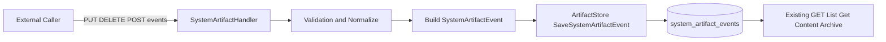

# 000: System Artifact 明示登録 CRUD API 仕様

## 背景 (Background)

### 現状

Tern の Artifact は、役割が次の 2 系統に分かれている。

| 種別 | 目的 | 主な API | 書き込み手段 |
| :--- | :--- | :--- | :--- |
| System Artifact | エージェントが触ったファイルの変更イベント記録 (`path + operation`) | `GET /api/v1/artifacts/system` ほか | 自動収集のみ (Tier1/2/3) |
| User Artifact | ユーザーが明示アップロードするデータ保管 | `PUT/GET/DELETE /api/v1/artifacts/user/{key}` | 明示 API / MCP |

System Artifact は read API が揃っている一方、create/update/delete は `ToolCallAnalyzer` による自動収集に依存している。

- Tier1: 構造化ツール (`Write` / `Edit` / `turn_diff` など)
- Tier2: シェルコマンド推定 (`shell_parser`)
- Tier3: workdir 差分補完 (`workdir_reconcile`)

Tier2 は best-effort であり、パターン外コマンドや実行環境差異で漏れるケースがある。Tier3 を ON にすれば漏れは減るが、セッション外変更の混入リスクがある。  
このため「必要な Artifact を外部から明示登録したい」という要望が成立する。

### 課題

1. **System Artifact に外部明示 C/U/D の入口がない**
   - 現在の `system` API は list/get/download/archive 中心。
2. **取りこぼし回復が運用頼み**
   - 自動収集漏れ時に API だけで補正できない。
3. **既存の保存モデルは十分に再利用可能**
   - `system_artifact_events` は append-only イベントとして C/U/D を表現できる。
   - つまり「新しい永続化方式」より「書き込み API 追加」で解ける。

### 本仕様で決めること

1. System Artifact を外部 API から明示的に C/U/D できること。
2. 既存の read API・event モデル・一覧フィルタ互換性を壊さないこと。
3. 自動収集 (Tier1/2/3) と明示登録を共存させること。
4. `client/v1` から同機能を型安全に呼べること。

### スコープ外

- User Artifact API の仕様変更
- unified diff 本文の永続化
- Artifact ごとの ACL/認可モデルの新規実装
- `file_change_collectors` の意味変更

---

## 要件 (Requirements)

### 必須要件 (Must)

#### R1: System Artifact に明示 CRUD を追加する

既存 read API は維持しつつ、次の write API を追加する。

| 操作 | Method | Path | 役割 |
| :--- | :--- | :--- | :--- |
| C/U (upsert) | `PUT` | `/api/v1/artifacts/system/{key}` | key に対する create/update イベントを追加 |
| D (logical delete) | `DELETE` | `/api/v1/artifacts/system/{key}` | key に対する delete イベントを追加 |
| C/U/D (低レベル append) | `POST` | `/api/v1/artifacts/system/events` | operation を明示したイベントをそのまま追加 |

`GET /api/v1/artifacts/system*` 系は後方互換で変更しない。

#### R2: 既存 event モデルを再利用する (append-only)

- 書き込みは `store.SystemArtifactEvent` を使って `SaveSystemArtifactEvent` へ保存する。
- 既存行の更新/削除は行わない（履歴を残す）。
- Update は「最新状態の上書き」ではなく「`operation=update` イベント追加」とする。
- Delete は「物理削除」ではなく「`operation=delete` の tombstone 追加」とする。

#### R3: リクエストスキーマを定義する

`PUT /api/v1/artifacts/system/{key}` および `DELETE /api/v1/artifacts/system/{key}` の Body:

```json
{
  "session_id": "sess-123",
  "turn_id": "turn-abc",
  "correlation_id": "corr-xyz",
  "actual_path": "/abs/path/to/file.txt",
  "tool_name": "api:system_manual",
  "occurred_at": "2026-09-09T14:30:00Z"
}
```

`POST /api/v1/artifacts/system/events` の Body:

```json
{
  "key": "reports/result.md",
  "operation": "create",
  "session_id": "sess-123",
  "turn_id": "turn-abc",
  "correlation_id": "corr-xyz",
  "actual_path": "/abs/path/to/result.md",
  "tool_name": "api:system_manual",
  "occurred_at": "2026-09-09T14:30:00Z"
}
```

制約:

- `operation` は `create|update|delete` のみ。
- `session_id` は必須（外部書き込みもセッション文脈を必ず持つ）。
- `key` は論理パス（空禁止、`..` を含む traversal 禁止、絶対パス禁止）。
- `tool_name` 省略時は `api:system_manual` を設定。
- `occurred_at` 省略時はサーバ現在時刻。

#### R4: `PUT` の create/update 判定を統一する

`PUT /{key}` は upsert とし、次で判定する。

1. `GetSystemArtifactByKey(key)` が空、または最新 operation が `delete` → `create`
2. それ以外 → `update`

レスポンス:

- create 時: `201 Created`
- update 時: `200 OK`

#### R5: パス検証と存在確認を行う

- `create` / `update` は `actual_path` 解決後の実ファイル存在を確認する。
  - 存在しない場合は `400 Bad Request`（理由: download/content API の整合性維持）。
- `delete` は存在確認不要。
- `actual_path` 未指定時は `session.work_dir + key` で解決する。
- 可能な限り `key` と `actual_path` の対応を正規化し、`key` 側に不正入力を残さない。

#### R6: 自動収集と明示登録を共存させる

- 明示 CRUD は `file_change_collectors` の ON/OFF に依存しない。
  - すべて OFF (`structured_tool=false` 等) でも API 書き込みは可能。
- 自動収集イベントと明示イベントは同一 `system_artifact_events` に並存する。
- 出所識別は `tool_name` で行う（`api:*` プレフィクスを予約）。

#### R7: 一覧・フィルタ互換を維持する

既存の `ListSystemArtifacts` / `include_deleted` / `operation` / `turn_id` / `correlation_id` フィルタはそのまま有効であること。

- delete 後に `include_deleted=false` で key が消える挙動を維持する。
- `include_deleted=true` で履歴が見えることを維持する。

#### R8: client/v1 に同等 API を追加する

`SystemArtifactClient` に次を追加する。

| メソッド | 目的 |
| :--- | :--- |
| `Put(ctx, key, req)` | 明示 create/update |
| `Delete(ctx, key, req)` | 明示 delete |
| `AppendEvent(ctx, req)` | operation 明示追加 (`POST /events`) |

追加型:

- `SystemArtifactWriteRequest`
- `SystemArtifactAppendRequest`
- `SystemArtifactWriteResponse`

#### R9: API/Client テストを追加する

- `shared/libs/go/artifact/api/system_test.go`
  - `PUT create`
  - `PUT update`
  - `DELETE tombstone`
  - validation error（bad key / missing session_id / missing actual file）
- `client/v1/artifacts_test.go`
  - 新規メソッドの HTTP マッピングと status code 取り扱い
- `tests/` integration
  - 明示 CRUD の E2E（list/content/archive との整合）
  - collectors OFF セッションでも write API が動くこと

#### R10: ドキュメント更新

- `docs/ReferenceManual-WebAPIs.md`
  - 新規 write API の request/response/エラーコード
  - append-only 意味論（update/delete はイベント追加）
- `README.md`
  - System Artifact の「自動収集 + 明示登録」二本立ての説明
  - Go Client 使用例（Put/Delete/AppendEvent）
  - 既存 User Artifact との使い分け

#### R11: 後方互換性を保証する

- 既存 read API のパス、レスポンス主要フィールド、既存テストを壊さない。
- 自動収集経路（Tier1/2/3）のデフォルト挙動を変えない。
- 既存 User Artifact API/MCP は無変更。

#### R12: エラーコード方針を固定する

| 条件 | Status |
| :--- | :--- |
| バリデーション不正（key/path/operation/body） | `400` |
| 指定 key が見つからず delete 不可（厳格モード） | `404` |
| method 不正 | `405` |
| 永続化失敗 | `500` |

※ delete の「未存在 key を 204 扱いにするか」は O2 で選択可能とする。

### 任意要件 (Optional)

#### O1: バルク登録 API

`POST /api/v1/artifacts/system/bulk` で複数イベントを 1 リクエスト投入できるようにする（最大件数制限あり）。

#### O2: delete の冪等モード

`DELETE` 時に `idempotent=true` 指定で「未存在 key でも 204」を許容する。

#### O3: Idempotency-Key

ヘッダ `Idempotency-Key` を受け取り、短時間重複リクエストによる二重 event 追加を抑止する。

---

## 実現方針 (Implementation Approach)

### 方針概要

既存の設計資産を活かし、**保存層はほぼ据え置き**で API 面を拡張する。

1. 既存 `SystemArtifactHandler` に write ルーティングを追加
2. `store.SystemArtifactEvent` を直接構築して保存
3. `client/v1` に対応メソッドを追加
4. 既存 list/get/content/archive がそのまま読めることを保証

### 既存実装の再利用ポイント

| 既存要素 | 再利用内容 |
| :--- | :--- |
| `shared/libs/go/artifact/api/system.go` | ルート配下に PUT/DELETE/POST(events) を追加 |
| `store.SaveSystemArtifactEvent` | 明示 C/U/D を append-only で保存 |
| `GetSystemArtifactByKey` | PUT の create/update 判定に利用 |
| `resolveArtifactPath` | content/archive の既存解決ロジックを維持 |
| `client/v1/artifacts.go` | SystemArtifactClient に write メソッド追加 |

### 追加実装の要点

1. **Route 拡張**
   - `routeRoot`: `GET` + `POST /events`
   - `routeByKey`: `GET` + `PUT` + `DELETE` + `GET /content`
2. **Validation ヘルパ**
   - key 正規化、path 解決、存在確認、RFC3339 parse
3. **Operation 判定**
   - `PUT` は最新 event 参照で create/update 決定
4. **Source 識別**
   - `tool_name` デフォルト `api:system_manual`
5. **Client 追加**
   - request/response 型、HTTP メソッド、エラーメッセージ統一

### アーキテクチャ図 (Mermaid)



### データ意味論

- 本機能は「メタデータ event の明示追加」であり、差分本文は保存しない。
- file content は従来どおり `actual_path` の実ファイルを read する。
- delete は履歴削除ではなく「最新状態を deleted にするイベント」。

---

## 検証シナリオ (Verification Scenarios)

### シナリオ1: L2 取りこぼしを API で補正できる

1. セッション `sess-a` で外部プロセスが `reports/a.txt` を生成
2. 自動収集に出ないことを確認
3. `PUT /api/v1/artifacts/system/reports/a.txt` を実行（`session_id=sess-a`）
4. `GET /api/v1/artifacts/system?session_id=sess-a&operation=create` で確認できる
5. `GET /api/v1/artifacts/system/reports/a.txt/content` が取得できる

### シナリオ2: update 履歴が追加される

1. 同 key に再度 `PUT`
2. status が `updated`
3. `GET /api/v1/artifacts/system/{key}` の `operations` に create→update が並ぶ

### シナリオ3: delete tombstone が反映される

1. `DELETE /api/v1/artifacts/system/{key}`
2. `include_deleted=false` の list から key が消える
3. `include_deleted=true` では履歴が見える

### シナリオ4: collectors 全 OFF でも明示登録できる

1. `file_change_collectors` を全 OFF でセッション作成
2. 自動収集イベントが増えないことを確認
3. 明示 `PUT` / `DELETE` は成功し list で見えることを確認

### シナリオ5: 不正入力が拒否される

- `../escape.txt`、絶対 key、存在しない actual_path、不正日時、未知 operation を `400` で拒否

---

## テスト項目 (Testing)

### 単体テスト

1. API Handler
   - `TestSystemAPI_Put_Create`
   - `TestSystemAPI_Put_Update`
   - `TestSystemAPI_Delete_Tombstone`
   - `TestSystemAPI_Write_BadRequestCases`
2. Store/整合
   - `GetSystemArtifactByKey` 最新判定の境界（delete 後の再 create）
3. Client
   - `TestSystemClient_Put`
   - `TestSystemClient_Delete`
   - `TestSystemClient_AppendEvent`

### 統合テスト (tests/)

1. `TestE2E_SystemArtifact_ExplicitCRUD`
2. `TestE2E_SystemArtifact_ExplicitCRUD_WithCollectorsOff`
3. `TestE2E_SystemArtifact_ContentAfterExplicitPut`

### 実行コマンド

> 位置づけカテゴリ: `common`  
> 注記: 現行 `scripts/process/integration_test.sh` は `--specify` のみ実装。  
> ワークフロー上のカテゴリ表記は残しつつ、実実行は `--specify` を使う。

```bash
./scripts/process/build.sh
./scripts/process/integration_test.sh --specify "TestSystemAPI_Put_|TestSystemClient_Put|TestE2E_SystemArtifact_ExplicitCRUD"
```

カテゴリ併記が必要な運用向け表記:

```bash
./scripts/process/integration_test.sh --categories common --specify "TestSystemAPI_Put_|TestSystemClient_Put|TestE2E_SystemArtifact_ExplicitCRUD"
```

---

## 受け入れ条件 (Acceptance Criteria)

1. System Artifact に対して外部 API から C/U/D が可能である。
2. 既存 read API と自動収集挙動は後方互換を維持する。
3. 明示登録イベントが既存 list/filter/content/archive で自然に扱える。
4. `client/v1` から同機能を利用できる。
5. 単体・統合テストが追加され、再現可能な実行コマンドが仕様に明記されている。

